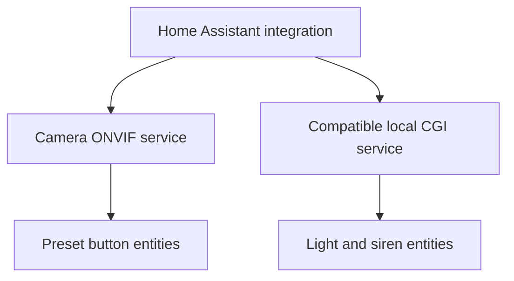

# How the integration works

## Background

The Imou Cruiser SE Plus exposes saved PTZ positions through ONVIF. However,
Home Assistant's standard ONVIF integration does not import these named presets
as individual button entities. The camera therefore supports the feature, but
the presets are not readily available to dashboards or automations.

The first workaround was a Windows Python bridge. It queried the presets over
ONVIF, published HTTP endpoints such as `/preset/1`, and relied on Home
Assistant YAML `rest_command` entries. That bridge demonstrated the missing
ONVIF functionality, but it did not solve the integration gap cleanly.

This custom integration addresses that ONVIF limitation directly by discovering
the camera's presets and representing them as native Home Assistant entities.
It also removes the workaround's Windows host, background EXE, extra TCP port,
plaintext JSON configuration and manual command-per-preset setup.

## Connection model

- ONVIF supplies media profiles, PTZ preset names and preset tokens.
- Pressing a preset button sends `GotoPreset` with the matching token.
- Compatible Imou firmware may expose a Dahua-derived local CGI endpoint for
  deterrence-light and speaker control.
- All camera communication stays on the local network.

## Capability handling

Preset support is mandatory during setup: the integration verifies that it can
connect and that a PTZ-capable ONVIF profile exists. A camera may validly return
zero presets, though no preset buttons will then be created.

Light and siren support is optional. The integration queries the compatible
status endpoint and only creates those entities when the matching status fields
are returned. Failure of the optional endpoint does not prevent ONVIF preset
buttons from loading.

## Security considerations

- Credentials are entered through Home Assistant's config flow and stored in
  the Home Assistant config entry.
- The integration does not use the Imou cloud or send credentials externally.
- ONVIF and compatible CGI traffic may use unencrypted HTTP on the trusted
  local network because that is what many camera firmware versions provide.
- Put cameras on an isolated VLAN where practical, block unnecessary internet
  access, and allow only the Home Assistant/Frigate hosts to reach them.
- Do not expose the camera HTTP or ONVIF port directly to the internet.

## Firmware compatibility

Imou models and regional firmware revisions do not expose identical local
interfaces. Preset control is based on standards-oriented ONVIF behavior, while
the optional deterrence features use a manufacturer-compatible API inherited
from Dahua camera firmware. Consequently:

- PTZ presets may work when siren and light controls do not.
- A camera may label its visible warning or spotlight output differently.
- Firmware may acknowledge a light command without changing the physical LED.
- A firmware update can change optional behavior.

The optional controls are therefore detected conservatively and documented as
firmware-dependent.

## Project status

This is an independent community integration. It is not affiliated with or
supported by Imou or Dahua. Test controls on your own camera before relying on
them in security or safety-critical automations.
